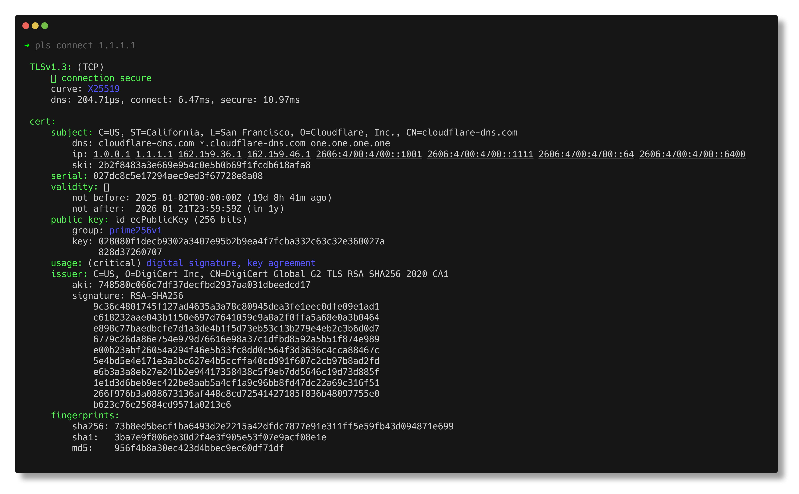

# pls

`pls` is a human-first tool for working with x509 certificates and other WebPKI/TLS
primitives. You ask it nicely to parse a file or get a server's certs and _It Just Works_.

- [Installation](#installation)
- [Examples](#examples)
- [FAQ](#faq)

## TL;DR

Reading a chain of certificates:

`pls`:

```bash
pls parse ./certs/chain.pem
```

`openssl`:

```bash
openssl storeutl -noout -text -certs ./certs/chain.pem
```

It. Just. Works.

No fussing with arguments, no "whoops, the file is chain. Guess I need to
manually split it up somehow". Or, "how do I connect to a server and just get
its chain? Wait, I need to pipe some output into `sed`. Why is my terminal
hanging? What's this debug stuff?"

Oh, and `pls` also handles certs mixed with yaml, json, or w/e just fine. Good
luck getting that to work with `openssl`.

And because it's 2025, there's json output with the `--json` flag. If you pipe
`pls`' output into another cli tool, _json output is automatic_.

```bash
pls parse ./certs/chain.pem | jq 'map(.subject.name)'
[
  "CN=lan.fish",
  "C=US, O=Let's Encrypt, CN=E6",
  "C=US, O=Internet Security Research Group, CN=ISRG Root X2"
]
```

> I'm still missing some fields in the json output, that's coming.

Chains are assumed. Yes it's annoying to put a `.[0]|` in front of `jq` filters, but for that everything just works if you end up "accidentally" parsing a chain.

It's also much more concise:

```sh
$ openssl x509 -in ./certs/lan-fish.pem -text -noout | wc -l
      73
$ pls parse ./certs/lan-fish.pem --text | wc -l
      25
```

### Parsing certs in nearly any medium

As long as the `----BEGIN` and `----END` "headers" exist somewhere in the file, and the base64 characters in those headers are valid, `pls` can parse it.

`pls` will parse:

- a stack of PEM (chain).
- certs spread throughout a yaml file with multiple indentations
- certs in escaped json

# Installation

Right now `pls` only supports Rust toolchain based installation:

```
cargo install --locked --git https://github.com/fisherdarling/pls
```

> We're currently using a fork of
> [`boring`](https://github.com/cloudflare/boring) which adds more support for
> reading x509 fields.

# Examples

## Parsing a cert

```bash
pls parse ./certs/cloudflare.pem
```


> Coloring is a little weird with [termshot](https://github.com/homeport/termshot).

## Connect to a server and viewing its certificate (QUIC coming soon!)

```bash
pls connect 1.1.1.1
```



### Easily force Post-Quantum Crypto for the handshake

```bash
pls connect 1.1.1.1 --pqc --no-cert
```


### Use a specific curve list

```bash
pls connect 1.1.1.1 --curves X25519MLKEM768 --no-cert
```


## JSON output

Unless another option is set, e.g. `--pem` or `--text`, `pls` will output json if stdout is [not a TTY](https://doc.rust-lang.org/stable/std/io/trait.IsTerminal.html#tymethod.is_terminal).

There's a ton of fields in the json output and many are redundant. The goal is to
make writing `jq` filters very easy.

```json
[
  {
    "subject": {
      "name": "CN=lan.fish",
      "ski": "a5bc6f4ea76b6de4f56bcf85ec86921c85b852b7",
      "sans": {
        "dns": ["lan.fish", "p2p.lan.fish"]
      }
    },
    "serial": "0347bb00b7415c11d012f7ca5686100f4474",
    "issuer": {
      "name": "C=US, O=Let's Encrypt, CN=E6",
      "aki": "9327469803a951688e98d6c44248db23bf5894d2"
    },
    "not_before": "2025-01-03T13:18:47Z",
    "not_after": "2025-04-03T13:18:46Z",
    "expires_in": 6236912,
    "valid_in": -1539086,
    "valid": null,
    "verify_result": null,
    "ski": "a5bc6f4ea76b6de4f56bcf85ec86921c85b852b7",
    "aki": "9327469803a951688e98d6c44248db23bf5894d2",
    "public_key": {
      "bits": 256,
      "curve": "id-ecPublicKey",
      "type": "ec",
      "group": "prime256v1",
      "key": "02886615260d6c0d06713f3d9a90f51f2214b799a07bf732335ef793fa05192cad"
    },
    "key_usage": {}, // snip: tons of booleans
    "signature": {
      "algorithm": "ecdsa-with-SHA384",
      "value": "</snip>"
    },
    "extensions": {},
    "sha256": "876172fb012989edbc93d2c4c34399f1dff9b5e90f0f30b9c6d2ed82ec184620",
    "sha1": "e317da2ee772c724754f489c4f06eb8f0fa14f37",
    "md5": "146f1fa78dee36f9421126e2a7cc589a",
    "pem": "</snip>"
  }
]
```

# FAQ

## Why does this use boringssl?

Because boringssl is awesome. If the library can't parse something that openssl, sorry about that.

## Why the name `pls`?

After doing 12 cert rotations involving modifying and looking at random PEM in yaml,
you start begging openssl to just `pls` do the right thing.

Why does openssl default to PEM output??? It's useless. And if you specify `-text` you still need to add `-noout`. What? Oh, and dealing with chains in a single file is clearly blasphemous.

And another gripe of mine is the usage of `ssl` in both `openssl` and `boringssl`. I refuse to put `ssl` in the name of this tool. There's a reason TLS exists. `pls` is close to `tls` while being short and sweet.

## Why do you only support x509 v3?

In my rather short experience working with certificates, I've only every seen v3 x509 certs. I believe the spec is 20 years old now. I'm not putting in effort to support older versions.

## The library doesn't support a curve!

If the curve is supported by boringssl, it's probably just not handled by `pls`. Please raise an issue.

## The library panics on my cert!

The "parser" is rather opnionated (read: full of `unwrap()`s) on what's considered optional. If the cert is a useful variant of x509 v3, please open an issue and I'll see about fixing things / making it optional.
